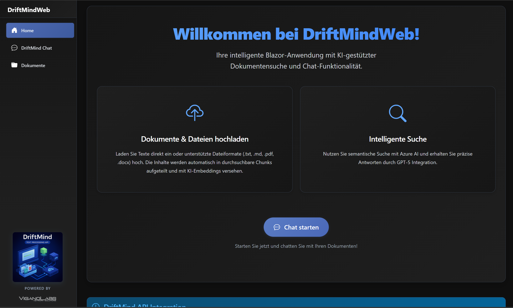

# DriftMindWeb

A modern Blazor Server application for interacting with the DriftMind API - an intelligent document processing and search system powered by Azure OpenAI and Azure AI Search.



## ✨ Key Features

- **💬 ChatGPT-like Interface** - Natural conversations with AI about your documents
- **📁 Document Management** - Upload, organize, and manage documents with secure downloads
- **🔄 Real-time Communication** - Powered by SignalR for instant responses
- **🎨 Modern Dark Theme** - Responsive design optimized for all devices
- **📄 Multi-format Support** - PDF, DOCX, TXT, and Markdown files
- **🔍 Semantic Search** - AI-powered document search with contextual answers

## 🚀 Quick Start

### Prerequisites
- .NET 8.0 SDK
- Running DriftMind API instance

### Installation
```bash
git clone https://github.com/JustDanMan/DriftMindWeb.git
cd DriftMindWeb
dotnet restore
dotnet run
```

Navigate to `https://localhost:5001` to start using the application.

### Basic Configuration
Edit `appsettings.json` to configure your DriftMind API connection:

```json
{
  "DriftMindApi": {
    "BaseUrl": "http://localhost:5175",
    "MaxUploadSizeMB": 12
  }
}
```

## 🐳 Docker Images

Pre-built Docker images are available on GitHub Container Registry (GHCR):

- **Release builds**: Tagged with version numbers (`v0.0.24-alpha`) and `latest`
- **Security builds**: Weekly rebuilds every Monday to include upstream security fixes
- **Manual builds**: Available for critical security updates

```bash
docker pull ghcr.io/justdanman/driftmindweb:latest
```

## ⚙️ Configuration

### Core Settings
The application can be configured through `appsettings.json`:

```json
{
  "DriftMindApi": {
    "BaseUrl": "http://localhost:5175",
    "MaxUploadSizeMB": 12
  },
  "ChatService": {
    "MaxSourcesForAnswer": 10,
    "ChatHistoryEnabled": true,
    "MaxChatHistoryMessages": 10
  },
  "DocumentsPage": {
    "InitialPageSize": 25,
    "EnableProgressiveLoading": true
  }
}
```

### Production Features

#### Azure SignalR Service
For scalable multi-instance deployments:

```json
{
  "AzureSignalR": {
    "Enabled": true,
    "ConnectionString": "Endpoint=https://your-signalr.service.signalr.net;AccessKey=...",
    "ApplicationName": "DriftMindWeb-Production"
  }
}
```

#### Shared Data Protection
For load-balanced deployments:

```json
{
  "SharedDataProtection": {
    "Enabled": true,
    "AzureStorage": {
      "ConnectionString": "DefaultEndpointsProtocol=https;AccountName=...",
      "ContainerName": "dataprotection-keys"
    }
  }
}
```

## 🛠️ Technical Overview

### Architecture
- **Frontend**: Blazor Server (.NET 8.0) with Interactive Server Rendering
- **Real-time**: SignalR (local or Azure SignalR Service)
- **UI**: Bootstrap 5 with custom dark theme
- **Security**: Token-based secure downloads with HMAC-SHA256
- **Deployment**: Docker-ready with Azure integration

### Supported File Formats
- **Documents**: PDF, DOCX, TXT, Markdown (up to 12MB)
- **Text Input**: Direct text entry up to 15KB
- **Features**: Automatic validation, smart truncation, real-time feedback

### API Integration
Key endpoints for DriftMind API communication:
- `POST /upload` - File and text upload with chunking
- `POST /search` - Semantic search with AI answers
- `POST /documents` - Document management with pagination
- `POST /download/token` - Secure download token generation

## 📚 Documentation

- [DriftMind API Documentation](./docs/README.DriftMind.md)
- [Azure SignalR Setup Guide](./docs/AZURE_SIGNALR_SETUP.md)
- [Shared Data Protection Setup](./docs/SHARED_DATA_PROTECTION_SETUP.md)
- [Screenshots](./docs/screenshots/)

## 🤝 Support

- **Issues**: [GitHub Issues](https://github.com/JustDanMan/DriftMindWeb/issues)
- **Documentation**: See the `/docs` folder for detailed guides
- **Troubleshooting**: Check SignalR status page for connection issues

## 📄 License

This project is licensed under the MIT License. See [LICENSE](LICENSE) for details.

**Note**: Certain branding assets in this repository are subject to additional usage restrictions. See [BRANDING.md](BRANDING.md) for more information.

## 📦 Third-Party Packages

The following third-party packages are used in this project. Their respective licenses apply to those components. The overall project license remains MIT as noted above.

| Package | Version | License | Copyright |
|---------|---------|---------|-----------|
| Azure.Extensions.AspNetCore.DataProtection.Blobs | 1.3.4 | MIT | © Microsoft Corporation |
| Azure.Storage.Blobs | 12.22.1 | MIT | © Microsoft Corporation |
| Markdig | 0.42.0 | BSD-2-Clause | © Alexandre Mutel |
| Microsoft.Azure.SignalR | 1.28.0 | MIT | © Microsoft Corporation |

Full license texts: see [THIRD-PARTY-NOTICES.md](./THIRD-PARTY-NOTICES.md).

---

**DriftMindWeb** - Intelligent document processing made simple 🚀